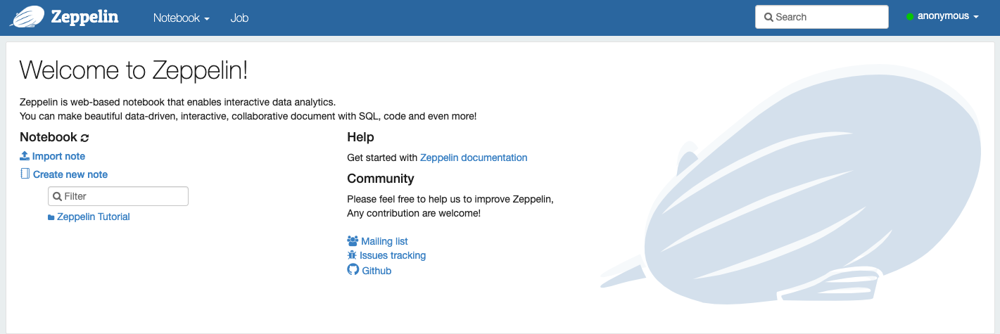
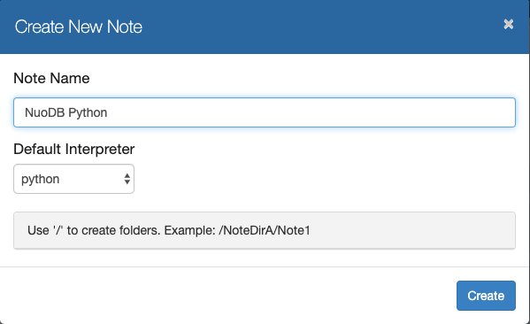
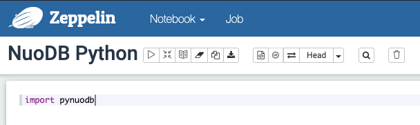
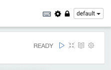
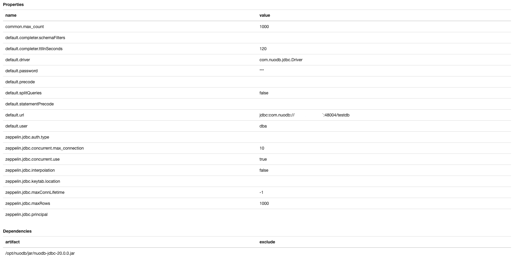

# NuoDB Analytics Using Zeppelin Notebooks, SparkSQL, Python and NuoSQL

This project will demonstrate how to run analytic queries and data visualisation using Zeppelin Notebooks with SparkSQL, Python and NuoSQL.

 This demo will use the following technologies:

- NuoDB distributed SQL relational database
- Spark
- Scala
- Python
- NuoSQL
- Zeppelin

## Pre-requisites


* A NuoDB database to run your queries against.
	* Hardware and software requirements for NuoDB are listed here - http://doc.nuodb.com/Latest/Default.htm#System-Requirements.htm
	* Installation and Deployment options are described here - http://doc.nuodb.com/Latest/Default.htm#Deployment-models.htm
	* You can download the NuoDB binaries for various platforms here - https://www.nuodb.com/dev-center/community-edition-download
	
* A machine on which to install Zeppelin.
	* This could be one of the NuoDB Transaction Engines (TE's), or a separate machine/cloud instance, or even a laptop. 
	* Ideally the Zeppelin server should be in close proximity to the data source in order to reduce latency.

## Installation

### Download the NuoDB JDBC Driver

Download the NuoDB JDBC driver - you can download the latest NuoDB JDBC driver from Maven Central directly from here - https://repo1.maven.org/maven2/com/nuodb/jdbc/nuodb-jdbc/20.1.0/nuodb-jdbc-20.1.0.jar

Place the JDBC driver in a location where it can be accessed by Zeppelin.

<BR>
### Apache Zeppelin

On the machine where Zeppelin will run, download the Binary package with all interpreters at https://zeppelin.apache.org/download.html

There is also a Docker image available, or the option to build from source.

In this example I'll deploy the Zeppelin binaries from the tarball distribution.

Install guide: https://zeppelin.apache.org/docs/0.8.1/quickstart/install.html

Documentation: http://zeppelin.apache.org/docs/0.8.1/index.html

Download the Zeppelin archive to a working directory.

```
$ ls
zeppelin-0.8.1-bin-all.tgz
```

Uncompress the archive and go into the extracted Zeppelin directory
```
$ tar xvf zeppelin-0.8.1-bin-all.tgz

$ cd zeppelin-0.8.1-bin-all

$ ls
LICENSE			bin			lib			logs			spark-warehouse
NOTICE			conf			licenses		notebook		zeppelin-web-0.8.1.war
README.md		interpreter		local-repo		run
```
Start the Zeppelin daemon:
```
$ bin/zeppelin-daemon.sh start
Zeppelin start                                             [  OK  ]
```

Go to the Zeppelin server at http://<your-zeppelin-host>:8080

Where <your-zeppelin-host> is the name or the address of the machine where Zeppelin is running.

At this point you will see the main Zeppelin page, where you can run the Zeppelin tutorials, import new notebooks, link to the documentation, etc.



<BR>
To stop Zeppelin use the stop option:

```
$ bin/zeppelin-daemon.sh stop
Zeppelin stopped                                           [  OK  ]
```
<BR>

### Python driver

On the machine where Zeppelin is running, download the NuoDB Python driver:

```
[Ec2-user_host-1 ~]$ curl -L https://github.com/nuodb/nuodb-python/archive/master.tar.gz | tar xz
  % Total    % Received % Xferd  Average Speed   Time    Time     Time  Current
                                 Dload  Upload   Total   Spent    Left  Speed
100   126    0   126    0     0    362      0 --:--:-- --:--:-- --:--:--   363
  0     0    0  351k    0     0   268k      0 --:--:--  0:00:01 --:--:-- 1041k
```

Install the NuoDB Python driver:


```
[Ec2-user_host-1 ~]$ cd nuodb-python*

[Ec2-user_host-1 nuodb-python-master]$ sudo python setup.py install
```

<BR>

## Create a Zeppelin Notebook to run Python against a NuoDB database

In Zeppelin, Click Notebook -> Create New Note
* Give your notebook a meaningful name, and select your default interpreter.
* The default interpreter is Spark, but in this case we will be using Python, so change the drop down selection accordingly.



* Click Create.

In the notebook, go to the first blank paragraph and type:
```
import pynuodb
```

Your screen should look like this:



<BR>
Then click the play icon on the right hand side of the paragraph to run the instruction.



<BR>
When the instruction completes (very quickly) you will get a message below it, like this:
```

Took 3 sec. Last updated by anonymous at August 06 2019, 5:46:03 PM.```

<BR>
<B>NB</B> If you had selected Spark as your default interpreter you would have to invoke the Python interpreter in each cell like this:

```
%python
import pynuodb
```

<BR>
<B>NB</B> 
You can change the default interpreter in a running notebook - use the cog symbol at the top right of the notebook to modify the notebook interpreter bindings. 


Now let's demonstrate how to connect to NuoDB using Python code running inside the notebook.

Add a paragraph below the one you used to import the NuoDB Python library
* Create a new paragraph by hovering the mouse over the lower edge of the existing paragraph.

Paste in the block of code below.

Edit the database connection details to match your environment and credentials - database name, host address or name, username and password, and schema name.

This block of Python code will connect to the database, drop the test table if it already exists, then creates the test table, inserts some records and finally queries them back.


```
options = {"schema": "user"}
connect_kw_args = {'database': "your-db", 'host': "your-server", 'user': "dba", 'password': "dba", 'options': options}

connection = pynuodb.connect(**connect_kw_args)
cursor = connection.cursor()
try:
    stmt_drop = "DROP TABLE IF EXISTS names"
    cursor.execute(stmt_drop)

    stmt_create = """
    CREATE TABLE names (
        id BIGINT NOT NULL GENERATED ALWAYS AS IDENTITY PRIMARY KEY,
        name VARCHAR(30) DEFAULT '' NOT NULL,
        age INTEGER DEFAULT 0
    )"""
    cursor.execute(stmt_create)

    names = (('Greg', 17,), ('Marsha', 16,), ('Jan', 14,))
    stmt_insert = "INSERT INTO names (name, age) VALUES (?, ?)"
    cursor.executemany(stmt_insert, names)

    connection.commit()

    age_limit = 15
    stmt_select = "SELECT id, name FROM names where age > ? ORDER BY id"
    cursor.execute(stmt_select, (age_limit,))
    print("Results:")
    for row in cursor.fetchall():
        print("%d | %s" % (row[0], row[1]))

finally:
    cursor.execute(stmt_drop)
    cursor.close()
    connection.close()
```
<BR>

After pasting in the code above, click the play/run icon. Your output will look like this:

```
Results:
1 | Greg
2 | Marsha

Took 1 sec. Last updated by anonymous at August 06 2019, 6:11:47 PM.
```

Now let's look at an example that return data from the sample Hockey database.

```
options = {"schema": "user"}
connect_kw_args = {'database': "your-db", 'host': "your-server", 'user': "dba", 'password': "dba", 'options': options}

connection = pynuodb.connect(**connect_kw_args)
cursor = connection.cursor()

try:

    querystr = "SELECT p.firstname,p.lastname,p.firstnhl,p.lastnhl,s.teamid,s.stint,gamesplayed FROM players p LEFT OUTER JOIN scoring s ON p.playerid = s.playerid AND p.firstnhl = s.year AND s.position = 'G' WHERE p.firstnhl = 2011 AND s.gamesplayed IS NOT NULL ORDER BY LASTNAME,FIRSTNAME,TEAMID"
    cursor.execute(querystr)

    for row in cursor.fetchall():
        print row[0], row[1],row[2],row[3],row[4],row[5],row[6]

finally:
    cursor.close()
    connection.close()


print
d.disconnect()
```

When you click the play/run icon you'll see the following data returned from NuoDB:

```
Brian Foster 2011 2011 FLO 1 1
Matt Hackett 2011 2011 MIN 1 12
Shawn Hunwick 2011 2011 CBS 1 1
Leland Irving 2011 2011 CAL 1 7
Mike Murphy 2011 2011 CAR 1 2
Anders Nilsson 2011 2011 NYI 1 4
Jussi Rynnas 2011 2011 TOR 1 2
Ben Scrivens 2011 2011 TOR 1 12
Iiro Tarkki 2011 2011 AND 1 1
Brad Thiessen 2011 2011 PIT 1 5
Allen York 2011 2011 CBS 1 11

```

We now have a working sample Python notebook that can access data in NuoDB.

<BR>

## Create a Zeppelin Notebook to run SparkSQL, Scala and Java instructions against a NuoDB database

This example will use SparkSQL and some light Scala to query the NuoDB database.

First we need to point the Spark interpreter to our NuoDB JDBC driver.

### Add the NuoDB JDBC driver to the Spark Shell artifact list.

Click the drop down next to anonymous in the top right corner of the page and select Intepreters.

Scroll down to the Spark definition. 

Click the edit button on the right hand side of the Spark interpreter section. Scroll down the Spark definition and add the artifact describing the location of the NuoDB JDBC driver that you downloaded previously onto the server where Zeppelin is running.

For example

```
Dependencies
artifact
/home/ec2-user/nuodb-jdbc-20.0.0.jar
```


### Create The Spark Notebook

Create a new blank workbook as as you did for Python, but this time leave the default interpreter set to Spark.

In the new empty cell, past the following library imports and run the cell:

```
import org.apache.commons.io.IOUtils
import java.net.URL
import java.nio.charset.Charset

import org.apache.log4j.{Level, Logger}
import org.apache.spark.{SparkConf, SparkContext}
import org.apache.spark.sql.{SQLContext, SaveMode}

import java.util.Properties;
import java.io._

import java.sql.DriverManager;
import java.sql.Connection;
import java.sql.PreparedStatement;
import java.sql.ResultSet;
import java.sql.SQLException;
import java.sql.Statement;
```
This might take a few seconds the first time that you run this command as it takes time for the Spark engine to initialise.

In a new cell set up some connection parameters (immutable Scala vals) and click run.

```
val jdbcHostname = "your-host"
val jdbcPort = 48004
val jdbcDatabase = "your-db"
val jdbcUsername = "dba"
val jdbcPassword = "dba"
val jdbcSchema   = "user"
```

In the next cell create the val containing the JDBC URL and click run.

```
val jdbcUrl = s"jdbc:com.nuodb://${jdbcHostname}:${jdbcPort}/${jdbcDatabase}"
```
You'll see output like this:

```
jdbcUrl: String = jdbc:com.nuodb://<your-hostname>:48004/your-db
```


In the next cell create the JDBC properties object and click run.

```
val connProperties = new Properties()
connProperties.put("user", s"${jdbcUsername}")
connProperties.put("password", s"${jdbcPassword}")
connProperties.put("schema", s"${jdbcSchema}")
```

You'll see this:

```
connProperties: java.util.Properties = {user=dba, password=dba, schema=user}
res45: Object = null
```

Now that you have a working connection, you can query the database. In the next cell we create a dataframe containing data from the Hockey sample schema. Click run.

```
val player1 = spark.read
  .format("jdbc")
  .option("url",jdbcUrl+"?user=dba&password=dba&schema=user")
  .option("dbtable", "players")
  .load()

```

You now have a dataframe called player1 containing the data from the players table in NuoDB.

In a new cell run the following command to print the dataframe schema:

```
player1.printSchema()
```

Your output will look like this:
```
root
 |-- PLAYERID: string (nullable = false)
 |-- FIRSTNAME: string (nullable = true)
 |-- LASTNAME: string (nullable = true)
 |-- HEIGHT: integer (nullable = true)
 |-- WEIGHT: integer (nullable = true)
 |-- FIRSTNHL: integer (nullable = false)
 |-- LASTNHL: integer (nullable = false)
 |-- POSITION: string (nullable = true)
 |-- BIRTHYEAR: integer (nullable = true)
 |-- BIRTHMON: integer (nullable = true)
 |-- BIRTHDAY: integer (nullable = true)
 |-- BIRTHCOUNTRY: string (nullable = true)
 |-- BIRTHSTATE: string (nullable = true)
 |-- BIRTHCITY: string (nullable = true)
```

How many records? Run this:
```
player1.count()

res48: Long = 7520
```

Finally, to actually view the data:
```
player1.show(5)
```
The output will be:
```
+---------+---------+----------+------+------+--------+-------+--------+---------+--------+--------+------------+----------+------------+
| PLAYERID|FIRSTNAME|  LASTNAME|HEIGHT|WEIGHT|FIRSTNHL|LASTNHL|POSITION|BIRTHYEAR|BIRTHMON|BIRTHDAY|BIRTHCOUNTRY|BIRTHSTATE|   BIRTHCITY|
+---------+---------+----------+------+------+--------+-------+--------+---------+--------+--------+------------+----------+------------+
|aaltoan01|    Antti|     Aalto|    73|   210|    1997|   2000|       C|     1975|       3|       4|     Finland|         0|Lappeenranta|
|abbeybr01|    Bruce|     Abbey|    73|   185|       0|      0|       D|     1951|       8|      18|      Canada|        ON|     Toronto|
|abbotge01|   George|    Abbott|    67|   153|    1943|   1943|       G|     1911|       8|       3|      Canada|        ON|    Synenham|
|abbotre01|      Reg|    Abbott|    71|   164|    1952|   1952|       C|     1930|       2|       4|      Canada|        MB|    Winnipeg|
|abdelju01|   Justin|Abdelkader|    73|   195|    2007|   2011|       L|     1987|       2|      25|         USA|        MI|    Muskegon|
+---------+---------+----------+------+------+--------+-------+--------+---------+--------+--------+------------+----------+------------+
only showing top 5 rows
```


<BR>

## Create a  Zeppelin Notebook to run SQL instructions against a NuoDB database


This notebook will use a custom NuoSQL interpreter to allow SQL commands to be run interactively against a NuoDB database.

There is no default NuoDB interpreter provided, but we can easily create one.


### Create The NuoSQL Interpreter

Create the interpreter config




<BR>
## Set Up User Security with Apache Shiro

By default, all users log in as anonymous.

<BR>
### Install Apache Shiro
We'll use Apache Shiro to enforce...

Download and install Shiro

<BR>
### Creating Roles & Users in Apache Shiro


Configure users in conf file

<BR>
### Setting Privileges in  Zeppelin Notebooks
set permissions in notebooks


